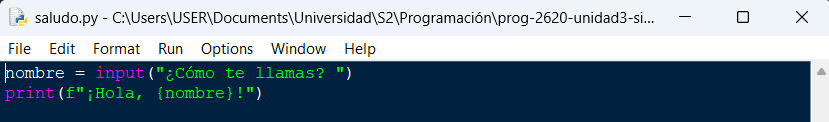
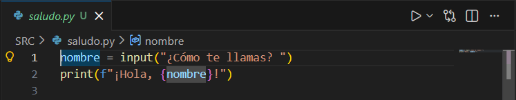
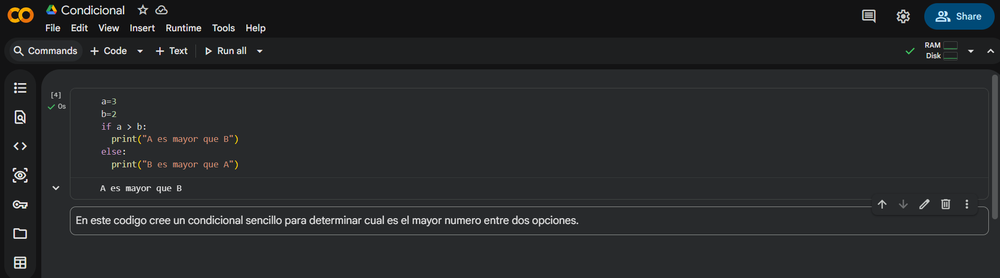

# Actividad 1  

## Instrucciones:  

1. Crea un script de Python y edítalo tanto con el IDLE de Python, como con VS Code. 
2. Crea una cuenta en Google Colab y crea un código de Python, prueba que funcione. Agrega un bloque de texto y explica qué fue lo que hiciste. 
3. Agrega imágenes (pantallazos) utilizando cada uno de los IDEs vistos en esta actividad.
4. Responde las siguientes preguntas con tus propias palabras (Nada de definiciones con IA o copiadas de internet). 
    1. ¿Qué es un IDE?
    2. ¿Cuál es la diferencia entre los 3 IDEs estudiados en esta actividad?
    3. ¿Cuál utilizarás en el resto del curso y por qué?

## Pantallazos:  

Script en IDLE:  

  

Script en Visual Studio Code:  

  

Script Google Colab:  

  

## Respuestas:  

1. Un IDE es una aplicación diseñada para editar código, compilarlo y poder ejecutarlo; todo en un mismo software.

2. El primer IDE (IDLE) esta hecho para aprender a codificar en una primera instancia sin necesidad de instalar ningún programa adicional. Viene incluido con Python. El segundo IDE (Visual Studio Code) es una aplicacion aparte, la cual tiene un buen interfaz y muchas opciones de personalización. El tercer IDE (Google Colab) corre en una maquina virtual y sirve para programar desde la nube.

3. Voy a utilizar Visual Studio Code porque siento que es el que tiene el mejor interfaz y no necesita internet para trabajar.

