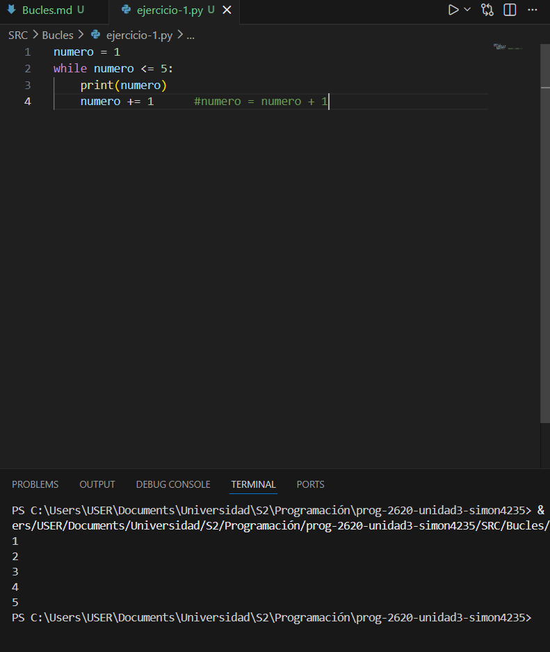
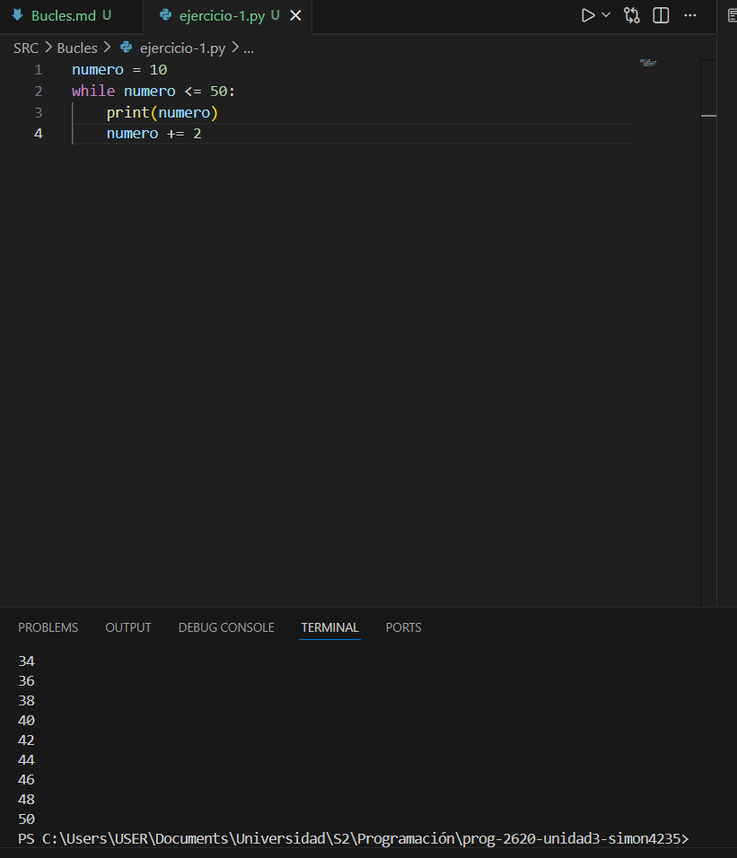
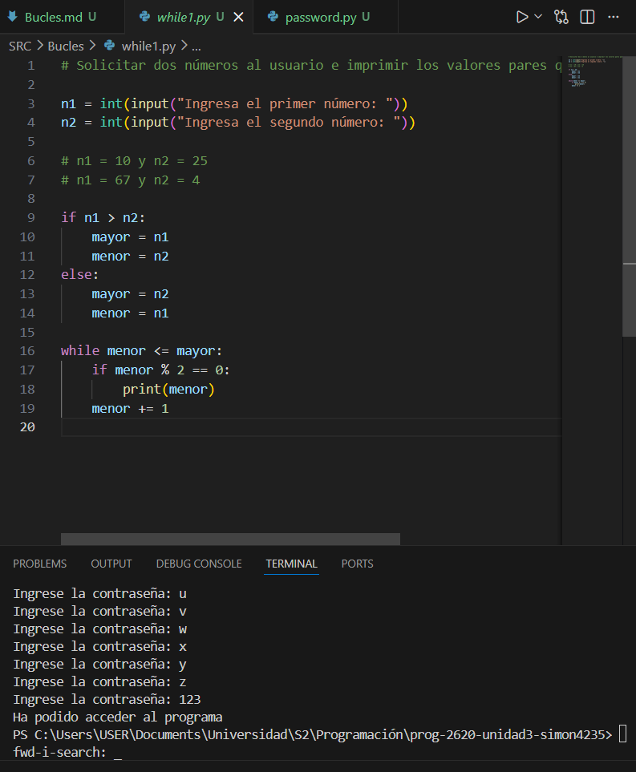
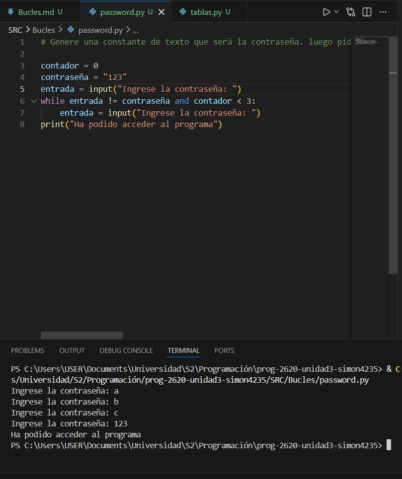
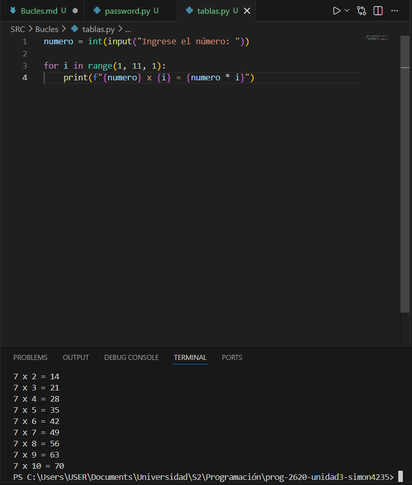

# Bucles o ciclos  

## Ejercicio 1:

Observa el siguiente ejemplo práctico de un bucle `while` que imprime números del 1 al 5:

### Imágen:



Ahora es tu turno. Modifica el código anterior, para que se imprima en la consola únicamente los números pares que hay entre 10 y 50. Analiza el ejemplo y responde las siguientes preguntas antes de comenzar a programar:

- ¿En qué valor debe iniciar la variable número?
- ¿Cuál es la condición que se debe cumplir para que el bucle se repita?
- ¿Cuál es el incremento que debo aplicar a la variable de control?

Luego de responder estas preguntas, habrás entendido lo que hay que hacer y podrás proponer tu solución.

### Respuestas:

- La variable debe de comenzar con el número 10, este será el primer numero que se imprime.  
- La condición debe de ser que los numeros sean menores o iguales a 50.  
- El incremento debe de ser 2, para que los numeros sean pares.

### Imágen:



## Bucles infinitos:  

Aquí tienes un ejemplo donde un error en la condición podría causar un bucle infinito:

```python
numero = 5
while numero > 0:  
    print(numero)
    numero += 1
```

Analiza el código anterior y responde:

- ¿Por qué se causa el bucle infinito?
- ¿Cómo se soluciona el problema?

### Respuestas:

- El bucle infinito se causa porque el bucle no tiene una condicion de salida adecuada, por lo que nunca termina.  
- El problema se soluciona presionando Ctrl + C

## Actividad while números pares:

### Imágen:



## Actividad while contraseña:

### Imágen: 



## Actividad for: 

### Imágen:  

