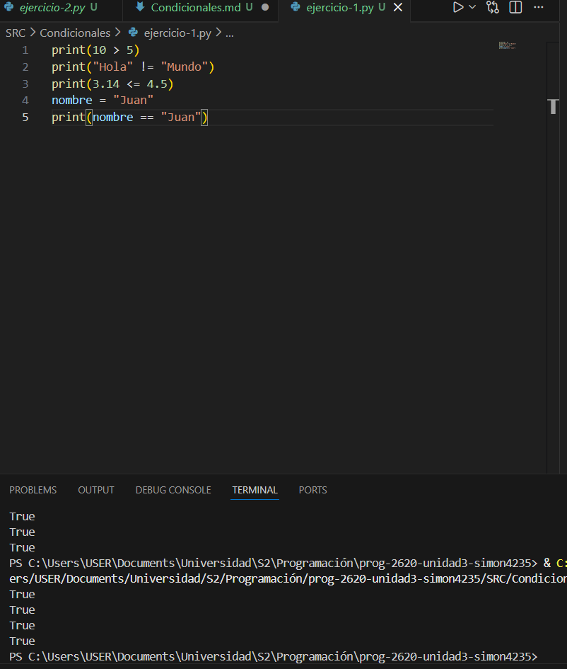
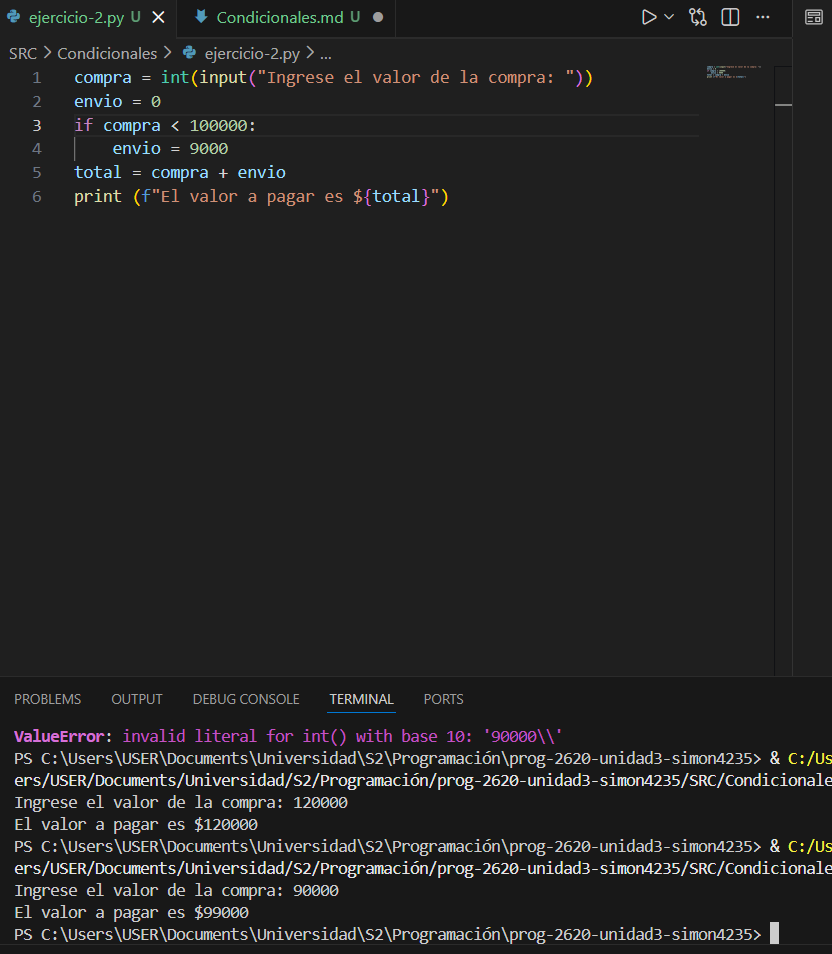
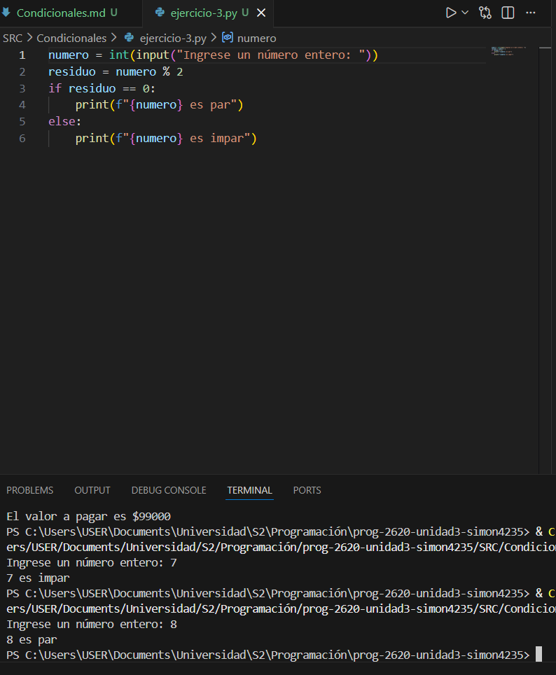
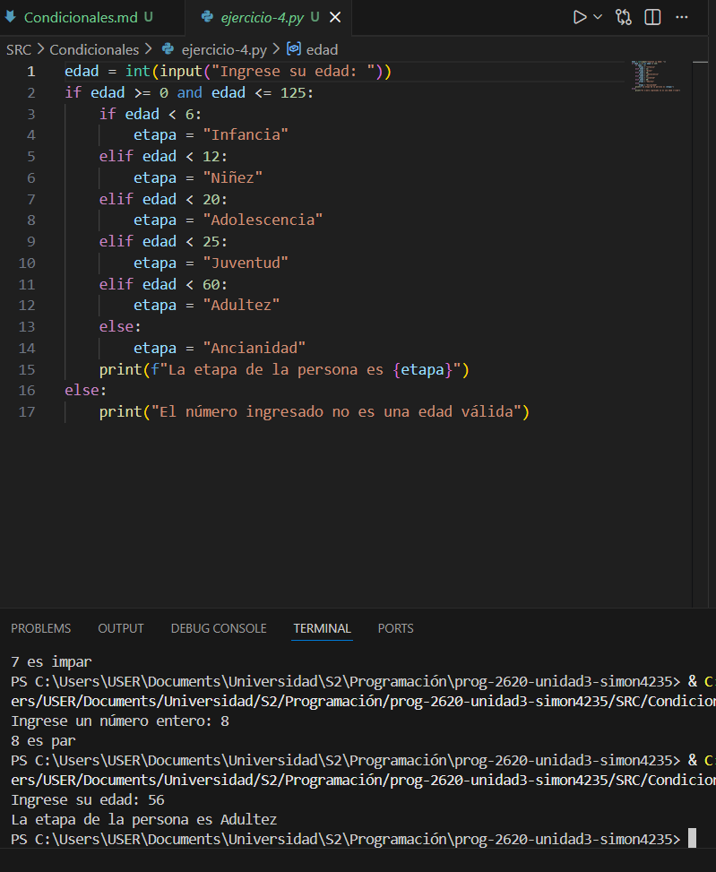
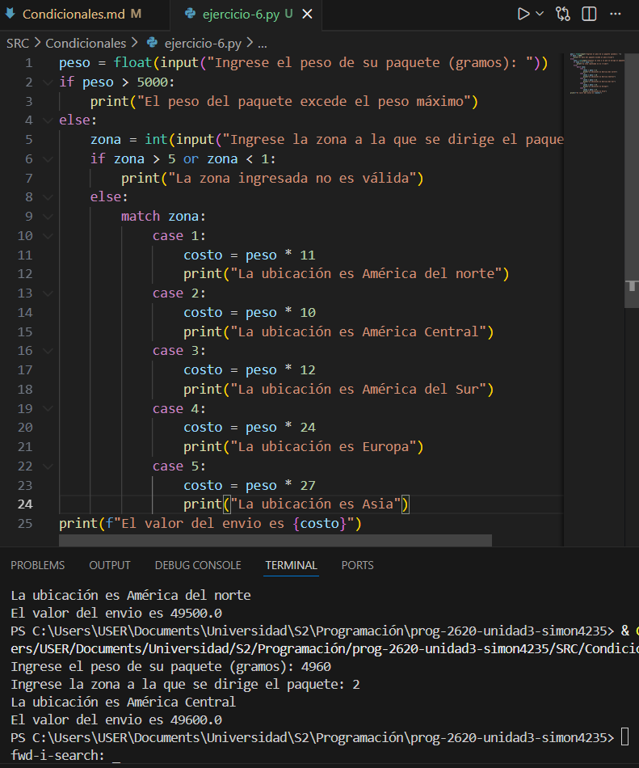

# Condicionales  

### Ejercicio 1

Comprueba en la consola de Python los siguientes códigos

### Imágen:

### Ejercicio 2

Resuelve el siguiente problema usando el condicional simple.

Un almacén cobra `$9 000` por costos de envío, pero ofrece el envío a domicilio gratis para compras superiores a `$100 000`. En caso contrario, no hay ningún descuento. Solicite al usuario el valor de la compra y calcule el valor total a pagar.

### Imágen:

### Ejercicio 3

Determine si un número ingresado por el usuario es par o impar.  

### Imágen:

### Ejercicio 4

El Ministerio de Salud clasifica las personas según las etapas del ciclo de vida, con el fin de tener una idea sobre su vulnerabilidad. Diseñe un algoritmo que pida al usuario su edad y la clasifique según la etapa del ciclo de vida que le corresponda. Verifique que el usuario no ingrese valores menores a cero. Clasificación etaria de la población colombiana:

- Infancia (0-6 años)
- Niñez (6 - 12 años)
- Adolescencia (12 - 20 años)
- Juventud (20 - 25 años)
- Adultez (25- 60 años)
- Ancianidad / Vejez (60 años o más)

### Imágen:

  

### Ejercicio 6

Una compañía de paquetería internacional tiene servicio en algunos países según su zona. El costo por el servicio de paquetería se basa en el peso del paquete y la zona a la que va dirigido. Parte de su política implica que los paquetes con un peso superior a 5 kg no son transportados por seguridad. Usa la siguiente tabla para resolver el problema:  

|Zona|Ubicación|Costo/gramo|  
|-|-|-|
|1|América del Norte|$11|  
|2|América Central|$10|  
|3|América del Sur|$12|  
|4|Europa|$24|  
|5|Asia|$27|  

### Imágen:  

