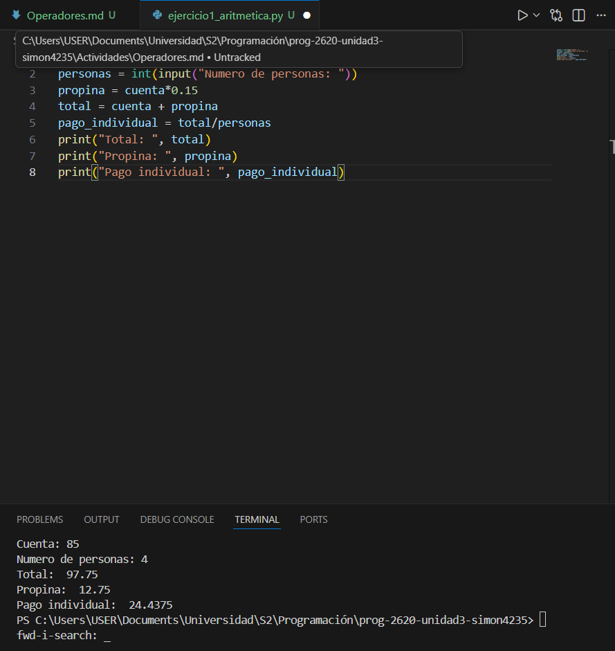
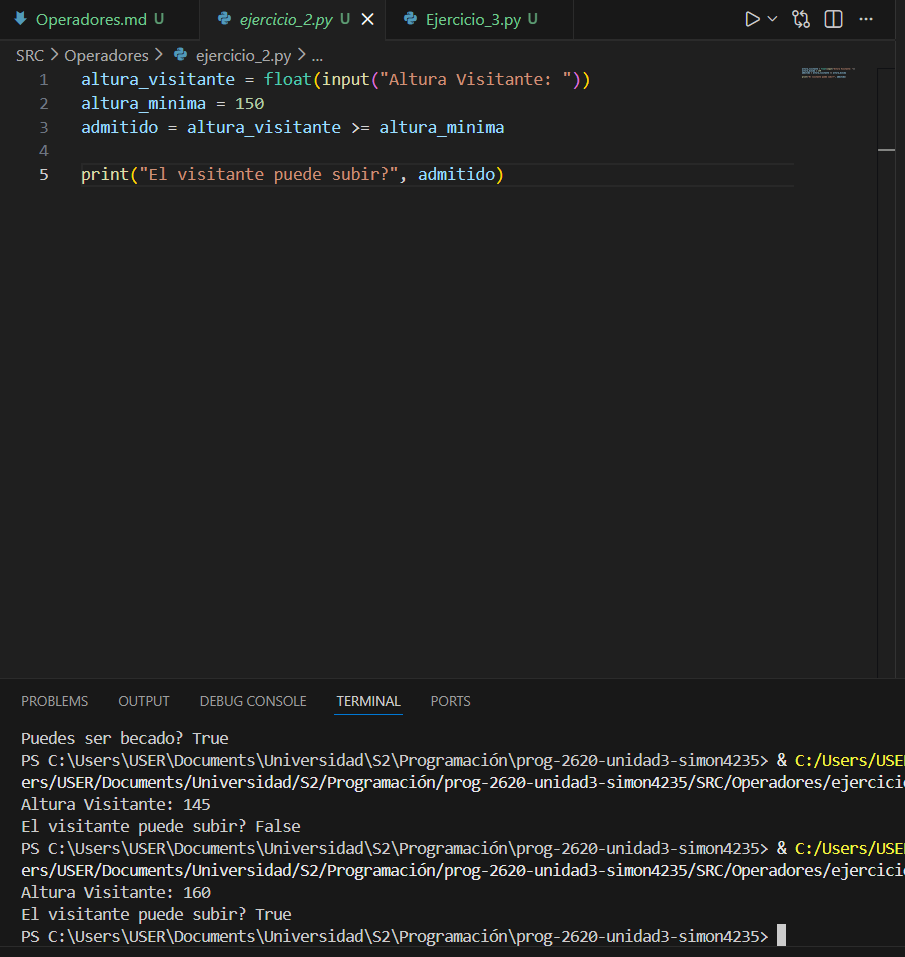
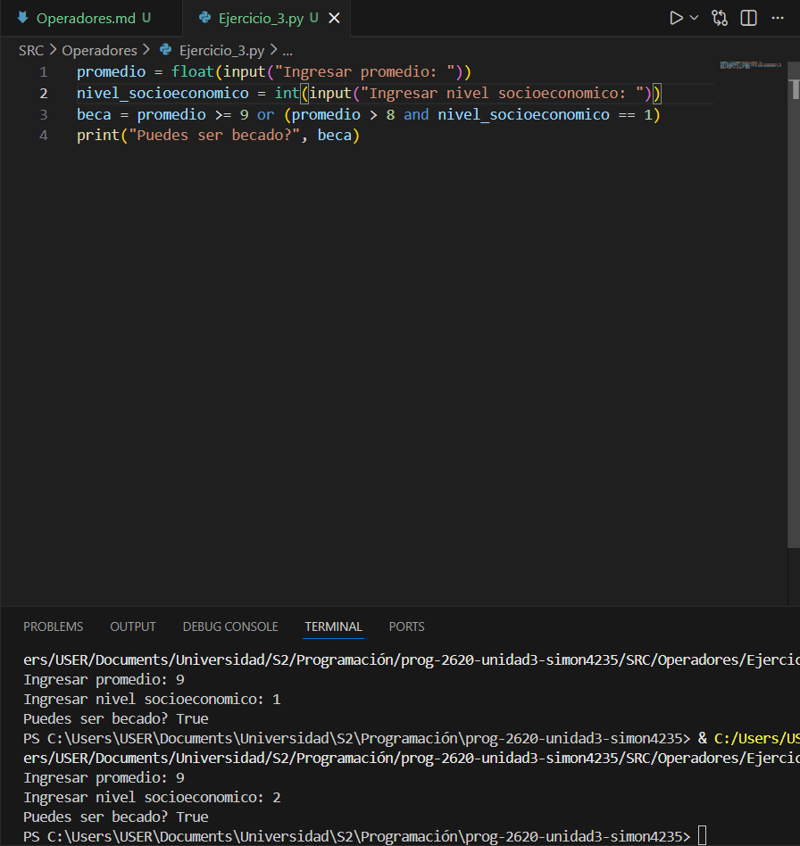
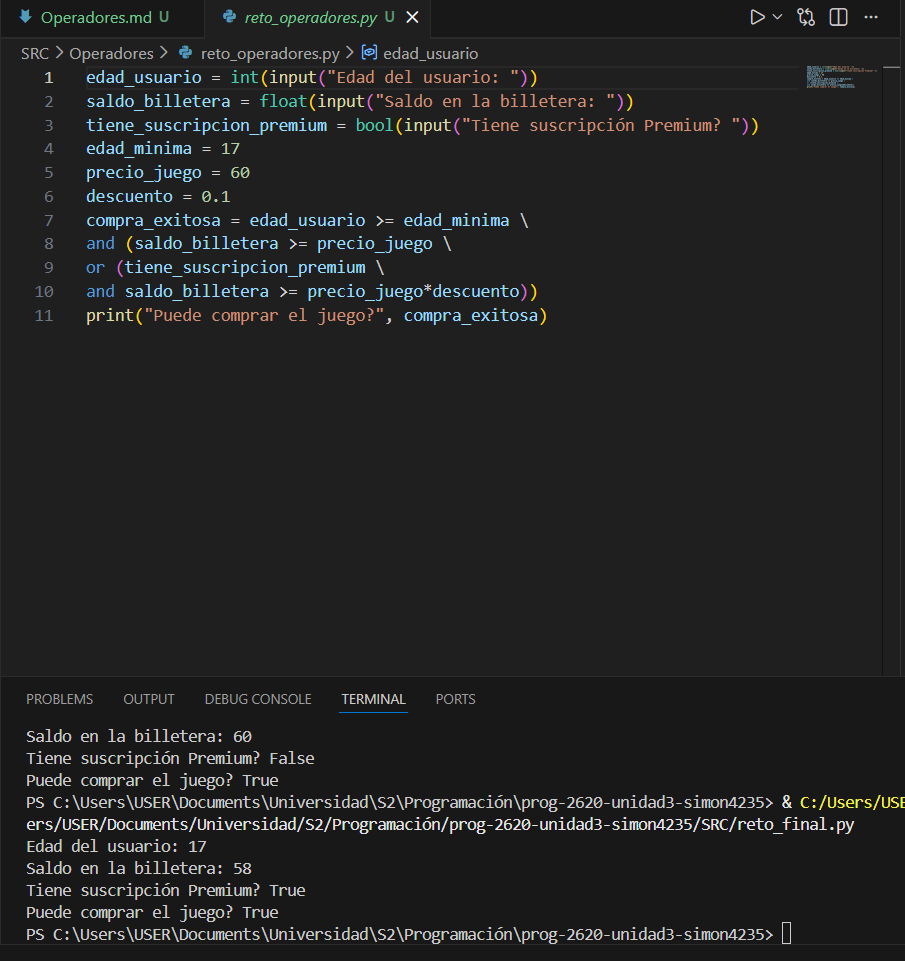

# Operadores  

## Pregunta Orientadora:  
Piensa en tu día a día. ¿Cuántas veces realizas cálculos mentales (como saber si te alcanza el dinero) o tomas decisiones basadas en condiciones (como "si llueve Y hace frío, llevo abrigo")? ¿Cómo crees que le enseñamos a una computadora a hacer exactamente lo mismo?

## Respuesta:
Nosotros le podemos enseñar a las computadoras estos proceso atravez de algoritmos que incluyan pasos detalladas, y que dentro de ellos se incluyan operadores que permitan tomar desiciones.

## Ejercicio 1: La cuenta del restaurante

## Ejercicio 2: El guardián de la montaña rusa  

Análisis: Cuando la altura es 145, el valor es False y cuando la altura es 160, el valor es True.

## Ejercicio 3: Sistema de Becas

Análisis: En este Codigo, primero se ingresan las variables de el nivel socioeconómico y el promedio, despues se crea una variable, la cual solo será verdadera si el promedio es mayor o igual a 9, o el promedio es mayor a 8 y el nivel socioeconómico es igual a 1

##  Reto Final de la Semana

Mayor dificultad: La mayor dificultad fue establecer el valor booleano de la variable (Compra_exitosa). En esta parte habia que establecer muchas operaciones en un mismo lugar, y habia que procurar mantener el orden.