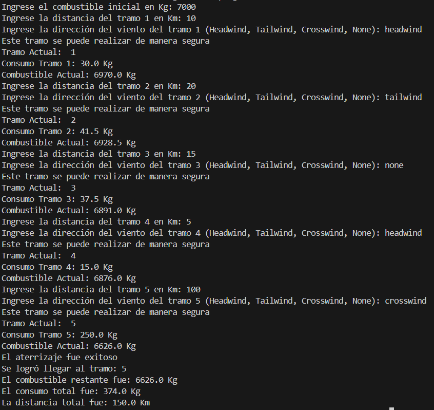
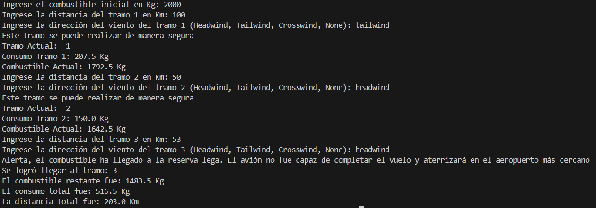

# Reto unidad 3
Simón Alvarez  
Edilberto Contreras  

# Fases del proyecto y entregables

## Fase 1: Análisis del Problema y Tabla de Datos

### 1. Tablas de entradas (input):

|Parametro|Tipo|Unidad|Descripcion|
|---|---|---|---|
|distancia_tramo|Float|Km|Distancia entre el tramo actual y el siguiente|
|direccion_viento|String|ND|Condicion del viento: HEADWIND, TAILWIND|
|combustible_inicial|Float|kg|Combustible inicial del avion|

### 2. Tabla de salidas (output):

|Salida|Tipo|Unidad|Descripcion|
|---|---|---|---|
|combustible_actual|Float|kg|Combustible disponible despues de un tramo|
|consumo_tramo|Float|kg|Combustible consumido en ese tramo|
|consumo_total|Float|kg|consumo total mas consumo por tramo|
|tramo_actual|Entero|ND|tramo actual del avion|
|mensaje al piloto|String|ND|continuar ruta o aterrizar alterno|

### 3. Tabla de constantes y variables de control:

|Nombre|Tipo|Unidad|Tipo de dato|Descripcion|
|---|---|---|---|---|
|consumo_por_kilometro|Constante|kg|Float|Consumo estandar del avion por kilometro|
|combustible_actual|Variable|kg|Float|Combustible disponible en cada iteracion|
|reserva_legal|Constante|kg|Float|Combustible minimo permitido 1500 kg|
|consumo_tramo|Variable|kg|Float|Combustible usado en el tramo|
|tramo_actual|Variable|Entero|int|Numero del tramo actual|
|consumo_headwind|Constante|%|Float|Aumento de consumo por viento en contra 120%|
|consumo_tailwind|Constante|%|Float|Disminucion de consumo por viento a favor 83%|

## Fase 2: Diseño de la Solución (Algoritmia)

### Pseudocódigo:

inicio  

leer combustible_inicial  
combustible_actual = combustible_inicial  
reserva_legal = 1500  
consumo_por_kilometro = 2.5  
consumo_headwind = 1.2  
consumo_tailwind = 0.83  
direccion_viento = ""  
tramo_actual = 0  
consumo_tramo = 0  
consumo_total = 0  
distancia_tramo = 0  
distancia_total = 0  
  

def calcular_consumo_tramo:  
    si direccion_viento == "headwind":  
        consumo_tramo = consumo_por_kilometro * distancia_tramo * consumo_headwind  
    sino:  
        si direccion_viento == "tailwind":  
            consumo_tramo = consumo_por_kilometro * distancia_tramo * consumo_tailwind  
        sino:  
            consumo_tramo = consumo_por_kilometro * distancia_tramo  
        fin si  
    fin si  
    devolver consumo_tramo  

para tramo_actual desde 1 hasta 6:  
    leer distancia_tramo  
    leer direccion_viento  
    
    consumo_tramo = calcular_consumo_tramo  

    combustible_actual = combustible_actual - consumo_tramo  
    consumo_total = consumo_total + consumo_tramo  
    distancia_total = distancia_total + distancia_tramo  

    si combustible_actual > reserva_legal:  
        imprimir "Este tramo se puede realizar de manera segura"  
    si no:
        break
    fin si

    imprimir tramo_actual  
    imprimir consumo_tramo  
    imprimir combustible_actual  
  
si combustible_actual > reserva_legal:  
    imprimir "El aterrizaje fue exitoso"  
si no:  
    imprimir "Alerta, el combustible ha llegado a la reserva lega. El avión no fue capaz de completar el vuelo y aterrizará en el aeropuerto más cercano"  
fin si  
  
imprimir tramo_actual  
imprimir combustible_actual  
imprimir consumo_total  
imprimir distancia_total  

## Fase 4: Implementación en Python

### Entregable 4 - Código Fuente Final:

Escenario 1:  
  
  
Escenario 2:

